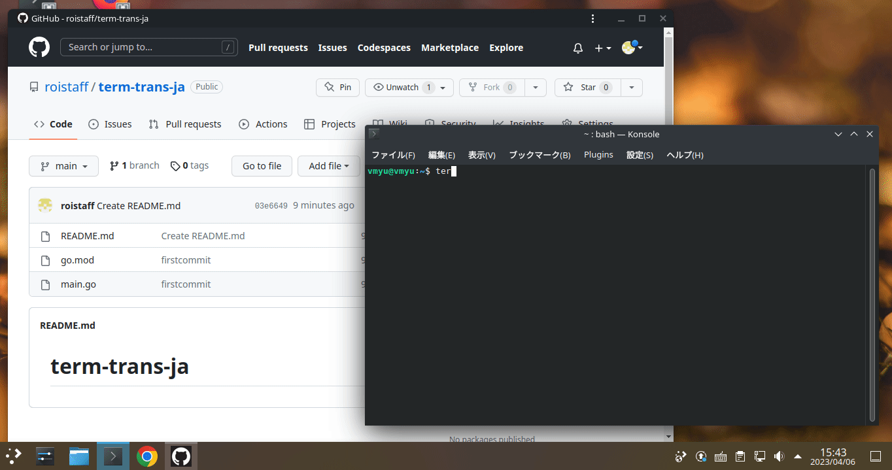

# term-trans-ja
わけのわからない英語で書かれたエラーがターミナルに表示されて困ったことがありませんか？  
　プログラミングの全てがほとんど英語で、特にエラーログは純粋な英語で書かれています。
英語で書かれたエラーログを理解することは、プログラミングの知識を深めることにもつながります。そこで、私はコマンドから英語を日本語に翻訳できるターミナルツールを作りました。

## DEMO

## Installation
Goがインストールされているなら以下のコマンドでインストールできます。
```
go install github.com/roistaff/term-trans-ja@latest
```
## Usage
使い方はとても簡単です。コマンドの引数に英文を渡します。
```
term-trans-ja "Hello,World!"
```
下のような翻訳結果が返ってきます。
```
こんにちは世界！
```
## Author
Staff Roi
Twitter @roi_staff

This has not made by GPT
